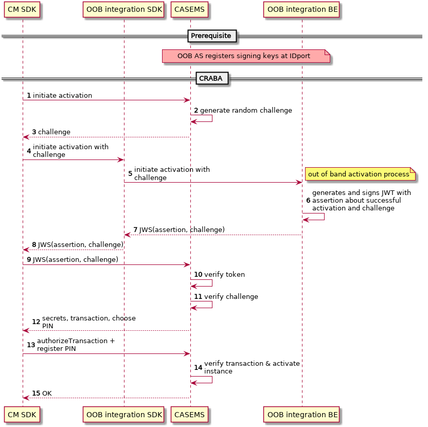

# Flow-test

The beginning of an awesome article...
```json http
{
  "method": "put",
  "url": "https://{serverName}/pushserver/v1.1/instances",
  "headers": {
    "authorization": "Bearer"
  },
  "body": "{\n  \"instance\": {\n    \"appId\": \"string\",\n    \"instanceId\": \"string\",\n    \"platform\": \"ANDROID\"\n  },\n  \"token\": {\n    \"value\": \"string\",\n    \"type\": \"FCM\"\n  }\n}"
}
```

## Flow obrázek
